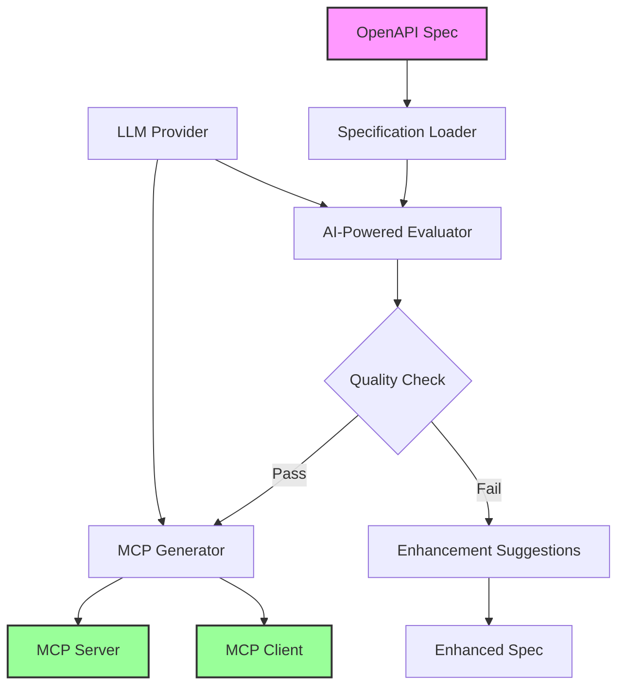

# OpenAPI to MCP Converter

[](LICENSE)
[](https://www.python.org/)
[](https://github.com/modelcontextprotocol)
[](https://github.com/psf/black)

> Transform your OpenAPI specifications into production-ready Model Context Protocol (MCP) servers with AI-powered enhancement and validation

**OpenAPI to MCP** is a powerful tool that automatically converts OpenAPI/Swagger specifications into fully functional MCP servers. It leverages Large Language Models (LLMs) to analyze, enhance, and generate MCP-compatible server implementations from your existing API documentation.

> [!CAUTION]
> The examples provided in this repository are for experimental and educational purposes only. They demonstrate concepts and techniques but are not intended for direct use in production environments. Make sure to have Amazon Bedrock Guardrails in place to protect against [prompt injection](https://docs.aws.amazon.com/bedrock/latest/userguide/prompt-injection.html). 


## Table of Contents

- [What's New](#whats-new)
- [Architecture](#architecture)
- [Features](#features)
- [Prerequisites](#prerequisites)
- [Installation](#installation)
- [Usage](#usage)
  - [Basic Usage](#basic-usage)
  - [Command Line Options](#command-line-options)
  - [Environment Variables](#environment-variables)
- [Examples](#examples)
- [Configuration](#configuration)
- [Output Structure](#output-structure)
- [AI Providers](#ai-providers)
- [Contributing](#contributing)
- [Security](#security)
- [License](#license)

## What's New

### v0.1.0
- Initial release with core functionality
- Support for OpenAPI 3.0 and Swagger 2.0 specifications
- AI-powered evaluation and enhancement
- Automatic MCP server and client generation
- Support for Amazon Bedrock and Anthropic Claude
- Comprehensive evaluation reports with usage tracking

## Architecture

The OpenAPI to MCP Converter follows a multi-stage pipeline architecture:



### Key Components

1. **Specification Loader**: Loads and validates OpenAPI/Swagger specifications from files or URLs
2. **AI-Powered Evaluator**: Uses LLMs to analyze API quality, completeness, and AI-readiness
3. **Enhancement Engine**: Provides actionable suggestions to improve your API specification
4. **MCP Generator**: Creates production-ready MCP server and client implementations
5. **Output Manager**: Organizes all generated files and reports in a structured format

## Features

### Core Features

The OpenAPI to MCP Converter provides a seamless bridge between your existing API documentation and the Model Context Protocol ecosystem. With just a single command, you can transform any OpenAPI or Swagger specification into a production-ready MCP server. The tool leverages advanced Large Language Models to not only convert but also analyze and enhance your API specifications, ensuring they meet the highest standards for AI integration.

Every conversion includes comprehensive evaluation reports that score your API across multiple dimensions including completeness, security, and AI-readiness. The built-in quality thresholds ensure that only specifications meeting your standards proceed to MCP generation, while detailed usage tracking helps you monitor LLM token consumption and associated costs across all operations.

### Evaluation Capabilities

The evaluation engine performs deep analysis of your OpenAPI specifications across multiple dimensions. It checks for API completeness by identifying missing descriptions, examples, and schemas that could impact usability. Security analysis evaluates your authentication and authorization schemes to ensure they meet modern security standards.

The AI readiness assessment is particularly valuable, determining how effectively your API will work with AI agents and automation tools. Built-in linting identifies specification issues and violations of OpenAPI best practices, while the operation analysis provides detailed reviews of each endpoint including parameter documentation, response schemas, and error handling.

### Generation Features

When your specification meets the quality thresholds, the tool generates a complete MCP implementation package. This includes a fully functional Python-based MCP server that implements all your API operations as MCP tools, along with a ready-to-use client for testing your implementation.

The generated package includes all necessary dependency files, comprehensive documentation with usage instructions, and detailed tool specifications that describe each operation in MCP format. Everything is organized in a clean directory structure, ready for deployment or further customization.

## Prerequisites

- Python 3.12 or higher
- [uv](https://github.com/astral-sh/uv) package manager
- Valid API credentials for your chosen LLM provider:
  - Amazon Bedrock credentials (for Claude via Bedrock)
  - Anthropic API key (for direct Claude access)

## Installation

### Quick Install

1. Clone the repository:
```bash
git clone https://github.com/agentic-community/openapi-to-mcp.git
cd openapi-to-mcp
```

2. Install dependencies using uv:
```bash
uv pip install -e .
```

3. Set up your environment variables:
```bash
cp env.example .env
# Edit .env with your API credentials
```

### Development Installation

For development with additional tools:
```bash
uv pip install -e ".[dev]"
```

## Usage

### Basic Usage

Evaluate and convert a local OpenAPI specification:
```bash
openapi-to-mcp my-api.yaml
```

Evaluate a specification from a URL:
```bash
openapi-to-mcp --url https://api.example.com/openapi.json
```

### Command Line Options

```bash
openapi-to-mcp [OPTIONS] [FILENAME]

Arguments:
  FILENAME              OpenAPI specification file (YAML or JSON)

Options:
  --url URL            URL to fetch OpenAPI specification from
  --output FILE        Output file for results (default: auto-generated)
  --eval-only         Only run evaluation, skip MCP generation
  --verbose           Enable verbose logging
  --show-env          Show environment configuration
```

### Environment Variables

Configure your LLM provider credentials through environment variables:

#### For Amazon Bedrock:
```bash
export AWS_PROFILE=your-profile-name
export AWS_REGION=us-east-1
```

#### For Anthropic Direct:
```bash
export ANTHROPIC_API_KEY=your-api-key
```

Note: The model selection is configured in `config/config.yml`, not through environment variables.

## Examples

### Example 1: Evaluate a Simple API

```bash
# Evaluate the example hello API
openapi-to-mcp examples/hello.yaml

# Check the generated output
ls output/results_*_hello/
```

### Example 2: Evaluate Only (No Generation)

```bash
# Just evaluate without generating MCP server
openapi-to-mcp my-api.yaml --eval-only
```

### Example 3: Custom Output Location

```bash
# Specify custom output file
openapi-to-mcp my-api.yaml --output results/my-api-evaluation.json
```


## Configuration

### Configuration File

The tool uses `config/config.yml` for all settings including model selection:

```yaml
# Model configuration - specify your model here
model: bedrock/us.anthropic.claude-3-5-sonnet-20241022-v2:0
# Or for Anthropic direct:
# model: anthropic/claude-3-5-sonnet-20241022

# Model parameters
max_tokens: 8192
temperature: 0.0
timeout_seconds: 300

# Evaluation thresholds
good_evaluation_threshold: 3.0
generate_mcp_threshold: 3.0

# Feature flags
debug: false
```

### Quality Thresholds

- **good_evaluation_threshold**: Minimum score for "good" evaluation (default: 3/5)
- **generate_mcp_threshold**: Minimum score to generate MCP server (default: 3/5)

Both completeness and AI readiness scores must meet the threshold for MCP generation.

## Output Structure

After running the tool, you'll find the following structure:

```
output/
└── results_YYYYMMDD_HHMMSS_<spec-name>_<provider>/
    ├── evaluation_YYYYMMDD_HHMMSS.json      # Detailed evaluation results
    ├── summary_YYYYMMDD_HHMMSS.md           # Human-readable summary
    ├── usage_YYYYMMDD_HHMMSS.json           # Token usage and costs
    ├── enhanced_spec_YYYYMMDD_HHMMSS.yaml   # Enhanced specification
    ├── original_spec_YYYYMMDD_HHMMSS.yaml   # Original specification
    └── mcpserver/                            # Generated MCP server (if criteria met)
        ├── server.py                         # MCP server implementation
        ├── client.py                         # MCP client for testing
        ├── requirements.txt                  # Python dependencies
        ├── README.md                         # Usage documentation
        └── tool_spec.txt                     # Tool specifications
```

## AI Providers

### Supported Providers

1. **Amazon Bedrock**
   - Models: Claude 3.5 Sonnet, Claude 3 Opus, Claude 3 Haiku
   - Region support: All AWS regions with Bedrock
   - Pricing: Pay per token via AWS

2. **Anthropic (Direct)**
   - Models: All Claude models
   - Global availability
   - Pricing: Pay per token via Anthropic

### Provider Selection

This solution uses [LiteLLM](https://github.com/BerriAI/litellm) for LLM provider management. The provider is automatically detected based on the prefix in the MODEL environment variable:

- Models prefixed with `bedrock/` use Amazon Bedrock
- Models prefixed with `anthropic/` use Anthropic directly
- Without a prefix, the model defaults to Anthropic

While LiteLLM supports many providers, this tool has been specifically tested and optimized for the Claude family of models through both Amazon Bedrock and Anthropic.

## Contributing

We welcome contributions! Please see our [Contributing Guidelines](CONTRIBUTING.md) for details.

### Development Setup

1. Fork the repository
2. Create a feature branch
3. Install development dependencies: `uv pip install -e ".[dev]"`
4. Make your changes
5. Run tests: `pytest`
6. Submit a pull request

## Security

### Security Best Practices

When using this tool, please follow these security guidelines:

1. **Sensitive Data in OpenAPI Specs**: Ensure that your OpenAPI specifications do not contain sensitive data such as real API keys, passwords, or personally identifiable information (PII) when testing with cloud-based LLM providers.

2. **Use Local Models for Sensitive Data**: If your OpenAPI specifications contain sensitive information, consider using locally hosted LLM models instead of third party model providers to maintain data privacy.

3. **Security Testing of Generated Code**: Always thoroughly review and test the generated MCP server code for security vulnerabilities before deploying to production. This includes:
   - Input validation and sanitization
   - Authentication and authorization checks
   - Rate limiting and abuse prevention
   - Secure handling of API credentials
   - Protection against common vulnerabilities (injection attacks, XSS, etc.)

4. **Environment Variables**: Never commit `.env` files or expose API credentials in your code repository. Use secure credential management practices.

### Reporting Security Issues

See [CONTRIBUTING](CONTRIBUTING.md#security-issue-notifications) for information on reporting security vulnerabilities in this project.

## License

This project is licensed under the Apache-2.0 License. See [LICENSE](LICENSE) for details.
