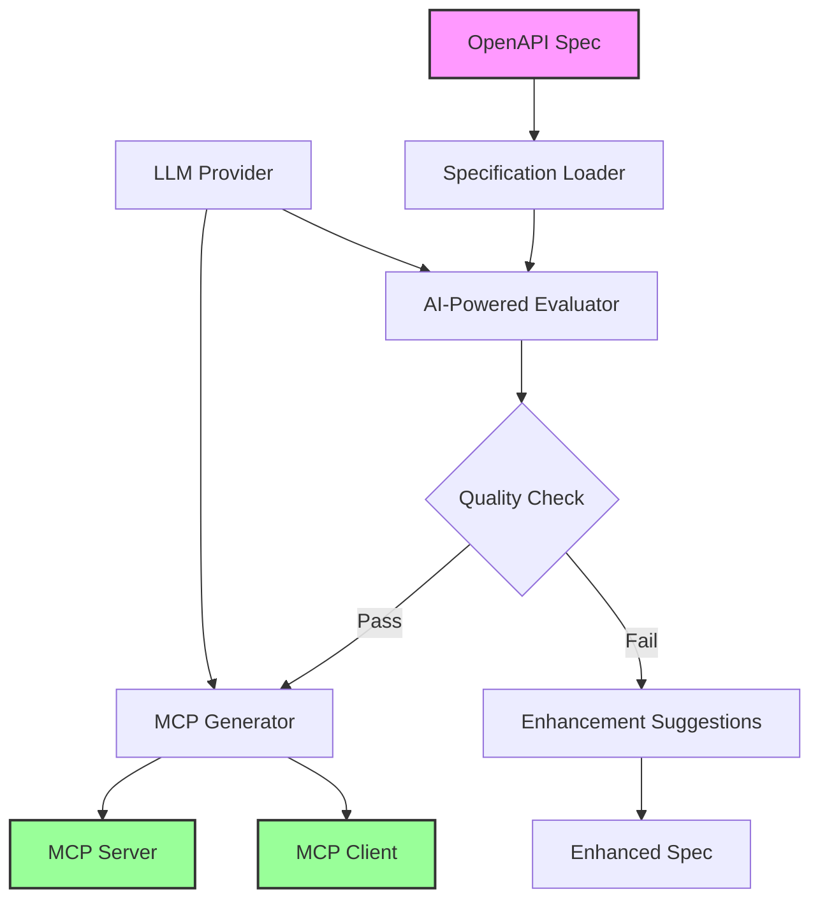

# OpenAPI to MCP Converter

[](LICENSE)
[](https://www.python.org/)
[](https://github.com/modelcontextprotocol)
[](https://github.com/psf/black)

> Transform your OpenAPI specifications into production-ready Model Context Protocol (MCP) servers with AI-powered enhancement and validation

**OpenAPI to MCP** is a powerful tool that automatically converts OpenAPI/Swagger specifications into fully functional MCP servers. It leverages Large Language Models (LLMs) to analyze, enhance, and generate MCP-compatible server implementations from your existing API documentation.

> [!CAUTION]
> The examples provided in this repository are for experimental and educational purposes only. They demonstrate concepts and techniques but are not intended for direct use in production environments. Make sure to have Amazon Bedrock Guardrails in place to protect against [prompt injection](https://docs.aws.amazon.com/bedrock/latest/userguide/prompt-injection.html). 


## Table of Contents

- [What's New](#whats-new)
- [Why This Solution](#why-this-solution)
- [Architecture](#architecture)
- [Features](#features)
- [Prerequisites](#prerequisites)
- [Installation](#installation)
- [Usage](#usage)
  - [Basic Usage](#basic-usage)
  - [Command Line Options](#command-line-options)
  - [Environment Variables](#environment-variables)
- [Examples](#examples)
- [Configuration](#configuration)
- [Output Structure](#output-structure)
- [AI Providers](#ai-providers)
- [Contributing](#contributing)
- [Security](#security)
- [License](#license)

## What's New

### v0.1.0
- Initial release with core functionality
- Support for OpenAPI 3.0 and Swagger 2.0 specifications
- AI-powered evaluation and enhancement
- Automatic MCP server and client generation
- Support for Amazon Bedrock and Anthropic Claude
- Comprehensive evaluation reports with usage tracking

## Why This Solution

As enterprises transition towards being AI-ready, a critical piece of the puzzle is ensuring their APIs are AI-ready as well. API specifications that were written for human consumption often lack the level of detail that Large Language Models require for reliable operation. While human developers can rely on domain expertise and tribal knowledge to fill in documentation gaps, LLMs may hallucinate missing information, leading to AI agents that cannot reliably invoke the right tools at the right time.

Common issues in human-oriented API documentation that impact AI readiness include:

- **Missing or vague descriptions**: Endpoints and parameters that lack detailed explanations of their purpose and behavior
- **Undefined parameter constraints**: Parameters without clearly defined ranges, formats, or validation rules
- **Incomplete error handling**: Missing documentation for error responses and edge cases
- **Unclear data relationships**: Lack of explicit documentation about how different API resources relate to each other
- **Missing pagination details**: APIs that handle large datasets but don't clearly document pagination mechanisms
- **Ambiguous filtering options**: Query parameters for filtering that lack comprehensive documentation
- **Implicit business logic**: Assumptions about workflow and usage patterns that aren't explicitly documented

When these incomplete API specifications are directly converted to MCP servers, the resulting tool specifications inherit the same deficiencies. This leads to unpredictable behavior that may be sub-optimal at best and completely broken at worst. The OpenAPI to MCP Converter addresses this gap by using AI to analyze, evaluate, and enhance your API specifications before generating MCP servers, ensuring they meet the quality standards required for reliable AI agent operation.

## Architecture

The OpenAPI to MCP Converter follows a multi-stage pipeline architecture:



### Key Components

1. **Specification Loader**: Loads and validates OpenAPI/Swagger specifications from files or URLs
2. **AI-Powered Evaluator**: Uses LLMs to analyze API quality, completeness, and AI-readiness
3. **Enhancement Engine**: Provides actionable suggestions to improve your API specification
4. **MCP Generator**: Creates production-ready MCP server and client implementations
5. **Output Manager**: Organizes all generated files and reports in a structured format

## Features

### Core Features

The OpenAPI to MCP Converter provides a seamless bridge between your existing API documentation and the Model Context Protocol ecosystem. With just a single command, you can transform any OpenAPI or Swagger specification into a production-ready MCP server. The tool leverages advanced Large Language Models to not only convert but also analyze and enhance your API specifications, ensuring they meet the highest standards for AI integration.

Every conversion includes comprehensive evaluation reports that score your API across multiple dimensions including completeness, security, and AI-readiness. The built-in quality thresholds ensure that only specifications meeting your standards proceed to MCP generation, while detailed usage tracking helps you monitor LLM token consumption and associated costs across all operations.

### Evaluation Capabilities

The evaluation engine performs deep analysis of your OpenAPI specifications across multiple dimensions. It checks for API completeness by identifying missing descriptions, examples, and schemas that could impact usability. Security analysis evaluates your authentication and authorization schemes to ensure they meet modern security standards.

The AI readiness assessment is particularly valuable, determining how effectively your API will work with AI agents and automation tools. Built-in linting identifies specification issues and violations of OpenAPI best practices, while the operation analysis provides detailed reviews of each endpoint including parameter documentation, response schemas, and error handling.

### Generation Features

When your specification meets the quality thresholds, the tool generates a complete MCP implementation package. This includes a fully functional Python-based MCP server that implements all your API operations as MCP tools, along with a ready-to-use client for testing your implementation.

The generated package includes all necessary dependency files, comprehensive documentation with usage instructions, and detailed tool specifications that describe each operation in MCP format. Everything is organized in a clean directory structure, ready for deployment or further customization.

## Prerequisites

- Python 3.12 or higher
- [uv](https://github.com/astral-sh/uv) package manager
- Valid API credentials for your chosen LLM provider:
  - Amazon Bedrock credentials (for Claude via Bedrock)
  - Anthropic API key (for direct Claude access)

## Installation

### Installing uv

First, install the uv package manager if you haven't already:

```bash
# On macOS and Linux
curl -LsSf https://astral.sh/uv/install.sh | sh

# On Windows
powershell -c "irm https://astral.sh/uv/install.ps1 | iex"

# Or using pip
pip install uv
```

### Quick Install

1. Clone the repository:
```bash
git clone https://github.com/agentic-community/openapi-to-mcp.git
cd openapi-to-mcp
```

2. Create and activate a virtual environment:
```bash
# Create virtual environment
uv venv

# Activate on macOS/Linux
source .venv/bin/activate

# Activate on Windows
.venv\Scripts\activate
```

3. Install dependencies using uv:
```bash
uv pip install -e .
```

4. Set up your environment variables:
```bash
cp env.example .env
# Edit .env with your API credentials
```

### Development Installation

For development with additional tools:
```bash
uv pip install -e ".[dev]"
```

## Usage

### Basic Usage

Evaluate and convert a local OpenAPI specification:
```bash
# For a simple example
openapi-to-mcp examples/hello.yaml

# For a more complex example
openapi-to-mcp examples/sample_api.yaml
```

Evaluate a specification from a URL:
```bash
openapi-to-mcp --url https://raw.githubusercontent.com/agentic-community/openapi-to-mcp/refs/heads/main/examples/hello.yaml
```

### Command Line Options

```bash
openapi-to-mcp [OPTIONS] [FILENAME]

Arguments:
  FILENAME              OpenAPI specification file (YAML or JSON)

Options:
  --url URL            URL to fetch OpenAPI specification from
  --output FILE        Output file for results (default: auto-generated)
  --eval-only         Only run evaluation, skip MCP generation
  --verbose           Enable verbose logging
  --show-env          Show environment configuration
```

### Environment Variables

Configure your LLM provider credentials through environment variables:

#### For Amazon Bedrock:
```bash
export AWS_PROFILE=your-profile-name
export AWS_REGION=us-east-1
```

#### For Anthropic Direct:
```bash
export ANTHROPIC_API_KEY=your-api-key
```

Note: The model selection is configured in `config/config.yml`, not through environment variables.

## Examples

### Example 1: Evaluate a Simple API

```bash
# Evaluate the simple hello API example
openapi-to-mcp examples/hello.yaml

# Check the generated output
ls output/results_*_hello/
```

### Example 2: Evaluate a Complex API

```bash
# Evaluate the more complex sample API with multiple endpoints
openapi-to-mcp examples/sample_api.yaml

# This example includes operations for users, products, and more
```

### Example 3: Evaluate from URL

```bash
# Evaluate directly from a URL
openapi-to-mcp --url https://raw.githubusercontent.com/agentic-community/openapi-to-mcp/refs/heads/main/examples/hello.yaml
```

### Example 4: Evaluate Only (No Generation)

```bash
# Just evaluate without generating MCP server
openapi-to-mcp examples/sample_api.yaml --eval-only
```

### Example 5: Custom Output Location

```bash
# Specify custom output file
openapi-to-mcp examples/hello.yaml --output results/my-api-evaluation.json
```

## Testing with Stub Server

This repository includes a complete end-to-end demonstration using the `examples/sample_api.yaml` specification. The sample API represents a fictional space mission control system with endpoints for spaceship telemetry, crew management, mission operations, and scientific experiments.

To facilitate testing without a real backend, we provide:
- A stub server (`examples/stub_server.py`) that implements the backend API with simulated responses
- Pre-generated MCP server and client code for immediate testing
- A complete workflow to test the entire chain from API specification to working MCP tools

### Pre-Generated Results

For convenience, we've included pre-generated results from evaluating `sample_api.yaml` in:
```
examples/results/anthropic/sample_api/
```

This directory contains evaluation reports, enhanced specifications, and a ready-to-run MCP server. See [RESULTS_GUIDE.md](docs/RESULTS_GUIDE.md) for detailed information about these files.

### Running the End-to-End Demo

Follow these steps to test the complete integration:

### Step 1: Start the Stub Server

First, run the stub server that simulates your API backend:

```bash
# Start stub server on port 9002
uv run examples/stub_server.py --port 9002
```

This creates a mock backend that responds to API requests with simulated data.

### Step 2: Set Authentication Token

Export the authentication token required by the MCP server:

```bash
export AUTH_TOKEN="your-secret-token"
```

### Step 3: Start the MCP Server

In a new terminal, navigate to the generated MCP server directory and start it:

```bash
# Navigate to the generated server directory
cd examples/results/anthropic/sample_api/mcpserver/

# Start the MCP server on port 9001, pointing to stub server on port 9002
python server.py --port 9001 --base-url http://localhost:9002
```

### Step 4: Test with the MCP Client

In another terminal, run the MCP client to interact with your server:

```bash
# From the same mcpserver directory
python client.py --server-url http://localhost:9001/mcp
```

The client will connect to the MCP server and allow you to test all the available tools.

### Example Workflow

```bash
# Terminal 1: Start stub server
uv run examples/stub_server.py --port 9002

# Terminal 2: Set auth and start MCP server
export AUTH_TOKEN="my-secret-token"
cd examples/results/anthropic/sample_api/mcpserver/
python server.py --port 9001 --base-url http://localhost:9002

# Terminal 3: Run client
cd examples/results/anthropic/sample_api/mcpserver/
python client.py --server-url http://localhost:9001/mcp
```

## Configuration

### Configuration File

The tool uses `config/config.yml` for all settings including model selection:

```yaml
# Model configuration - specify your model here
model: bedrock/us.anthropic.claude-3-5-sonnet-20241022-v2:0
# Or for Anthropic direct:
# model: anthropic/claude-3-5-sonnet-20241022

# Model parameters
max_tokens: 8192
temperature: 0.0
timeout_seconds: 300

# Evaluation thresholds
good_evaluation_threshold: 3.0
generate_mcp_threshold: 3.0

# Feature flags
debug: false
```

### Quality Thresholds

- **good_evaluation_threshold**: Minimum score for "good" evaluation (default: 3/5)
- **generate_mcp_threshold**: Minimum score to generate MCP server (default: 3/5)

Both completeness and AI readiness scores must meet the threshold for MCP generation.

## Output Structure

After running the tool, you'll find the following structure:

```
output/
└── results_YYYYMMDD_HHMMSS_<spec-name>_<provider>/
    ├── evaluation_YYYYMMDD_HHMMSS.json      # Detailed evaluation results
    ├── summary_YYYYMMDD_HHMMSS.md           # Human-readable summary
    ├── usage_YYYYMMDD_HHMMSS.json           # Token usage and costs
    ├── enhanced_spec_YYYYMMDD_HHMMSS.yaml   # Enhanced specification
    ├── original_spec_YYYYMMDD_HHMMSS.yaml   # Original specification
    └── mcpserver/                            # Generated MCP server (if criteria met)
        ├── server.py                         # MCP server implementation
        ├── client.py                         # MCP client for testing
        ├── requirements.txt                  # Python dependencies
        ├── README.md                         # Usage documentation
        └── tool_spec.txt                     # Tool specifications
```

## Understanding the Results

The OpenAPI to MCP Converter generates comprehensive evaluation reports and MCP implementations. To help you understand and work with these outputs:

📖 **[View the Results Guide](docs/RESULTS_GUIDE.md)**

This guide explains:
- What each generated file contains and its purpose
- How to interpret evaluation scores and quality metrics
- Understanding pagination and filtering support indicators
- Working with the generated MCP server and client code
- Links to example files from our pre-generated sample API results

The pre-generated results in `examples/results/anthropic/sample_api/` serve as a reference implementation showing what a high-quality conversion looks like.

## AI Providers

### Supported Providers

1. **Amazon Bedrock**
   - Models: Claude 3.5 Sonnet, Claude 3 Opus, Claude 3 Haiku
   - Region support: All AWS regions with Bedrock
   - Pricing: Pay per token via AWS

2. **Anthropic (Direct)**
   - Models: All Claude models
   - Global availability
   - Pricing: Pay per token via Anthropic

### Provider Selection

This solution uses [LiteLLM](https://github.com/BerriAI/litellm) for LLM provider management. The provider is automatically detected based on the prefix in the MODEL environment variable:

- Models prefixed with `bedrock/` use Amazon Bedrock
- Models prefixed with `anthropic/` use Anthropic directly
- Without a prefix, the model defaults to Anthropic

While LiteLLM supports many providers, this tool has been specifically tested and optimized for the Claude family of models through both Amazon Bedrock and Anthropic.

## Contributing

We welcome contributions! Please see our [Contributing Guidelines](CONTRIBUTING.md) for details.

### Development Setup

1. Fork the repository
2. Create a feature branch
3. Install development dependencies: `uv pip install -e ".[dev]"`
4. Make your changes
5. Run tests: `pytest`
6. Submit a pull request

## Security

### Security Best Practices

When using this tool, please follow these security guidelines:

1. **Sensitive Data in OpenAPI Specs**: Ensure that your OpenAPI specifications do not contain sensitive data such as real API keys, passwords, or personally identifiable information (PII) when testing with cloud-based LLM providers.

2. **Use Local Models for Sensitive Data**: If your OpenAPI specifications contain sensitive information, consider using locally hosted LLM models instead of third party model providers to maintain data privacy.

3. **Security Testing of Generated Code**: Always thoroughly review and test the generated MCP server code for security vulnerabilities before deploying to production. This includes:
   - Input validation and sanitization
   - Authentication and authorization checks
   - Rate limiting and abuse prevention
   - Secure handling of API credentials
   - Protection against common vulnerabilities (injection attacks, XSS, etc.)

4. **Environment Variables**: Never commit `.env` files or expose API credentials in your code repository. Use secure credential management practices.

### Reporting Security Issues

See [CONTRIBUTING](CONTRIBUTING.md#security-issue-notifications) for information on reporting security vulnerabilities in this project.

## License

This project is licensed under the Apache-2.0 License. See [LICENSE](LICENSE) for details.
